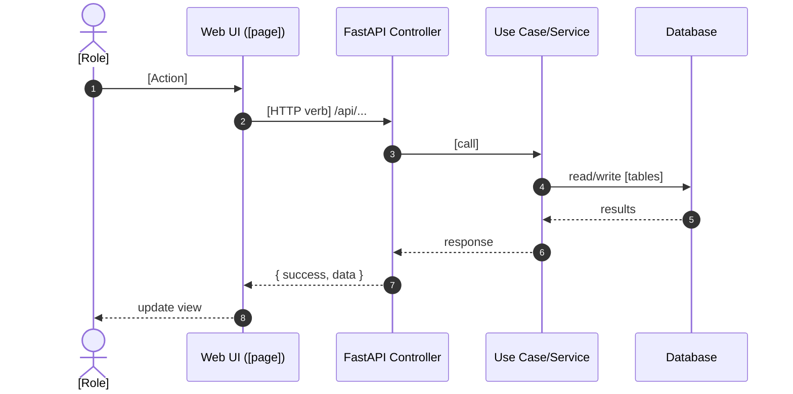

# [FLOW NAME] — Flow Guide (v2)

## Summary (TL;DR)
- Purpose: [1–2 sentences].
- Primary user(s): [roles].
- Entry point: `[route or trigger]` → `[controller/use case]` → `[service]` → `[tables]`.

## State Snapshot
- Current: [brief current behavior].
- Intended: [brief intended future behavior].

## Actors & Permissions
- Roles: [agent|qa|insights|admin].
- Access: [who can use this flow].
- Protected resources: [resource:action checks].

## At-a-Glance Map
- Route (page): `/[route]` (if Page).
- Controller(s): `app/interfaces/web/controllers/[...].py#[function]`.
- Use case(s): `app/application/use_cases/[...].py#[class or func]`.
- Service(s): `app/application/services/[...].py#[method]`.
- Repository/DB: `app/infrastructure/[...].py` tables: [list].
- Frontend: `web_ui/templates/[...].html` components: [list].

## Sequence (Mermaid)


## Concise Flow Blocks (↓ style)
Use these per action to document the exact call path succinctly.

#### Frontend Flow
```javascript
// [page.html] — Source: web_ui/templates/[...].html
[ClassName].[methodName]()
  ↓
fetch(`/api/[endpoint]/${id}?param=${value}`)
  ↓
[ClassName].[displayMethod]()
```

#### Backend Flow
```python
# [controller.py] — Source: app/interfaces/web/controllers/[...].py
@router.get("/api/[endpoint]/{id}")
async def [function_name](...):
  ↓
# Query database/repository
[Repository].[method]()  # or: SELECT ... FROM [table]
  ↓
# Return formatted data
return [response_model]
```

## Actions → Endpoints → Code
| Action (UI) | Endpoint | Controller -> Use Case/Service | Notes |
|---|---|---|---|
| [Click/Submit …] | `GET/POST /api/...` | `[controller.py]#[func]` → `[use_case.py]#[execute]` | Current vs Intended notes |

## Data Lineage
- Reads: [tables/entities]
- Writes: [tables/entities]
- Invariants: [rules that must not break]
- Idempotency: [keys/approach]

## Security & Privacy
- Auth/Permissions: [resource:action checks, roles]
- Data sensitivity/PII: [fields, masking/redaction]
- CSRF/session: [notes for page/API]

## Consumption (Interface-Agnostic Contract)
- Interfaces: [none|api|ui|both]
- Consumers: [which pages/controllers/jobs use this flow]

## Error Handling
- UI: [errors shown, recovery]
- API: [status codes, messages]
- Retries/Backoff: [if any]

## Performance
- Pagination/limits: [params]
- Caching/indexes: [notes]

## Background Triggers (if any)
- What gets queued: [jobs]
- Worker/process: [name]

## Current vs Intended — Step Highlights
- Step [n]: Current … → Intended …
- Step [n+1]: Current … → Intended …

## File Index (Clickable)
- UI: `web_ui/templates/[...].html`
- Controller: `app/interfaces/web/controllers/[...].py`
- Use Case: `app/application/use_cases/[...].py`
- Service: `app/application/services/[...].py`
- Repo/DB: `app/infrastructure/[...].py`

### Notes on Locations Referenced Above
- Clarify any paths used in code blocks (e.g., import sources, proposed new files).
- Example: `get_session()` dependency proposed at `app/interfaces/web/dependencies/db_session.py`.

## Machine-Readable Index (YAML)
```yaml
flow:
  name: [FLOW NAME]
  type: [page|process]
  route: /[route]
  params: [param1, param2]
actors: [agent, qa]
endpoints:
  - method: GET
    path: /api/[...]
    controller: app/interfaces/web/controllers/[...].py#[func]
    use_case: app/application/use_cases/[...].py#[class_or_func]
    tables_read: [table1, table2]
    tables_write: [table3]
ui_components: [DataTable, FilterRow, …]
tables: [conversations, transcripts, …]
background_jobs: [ingestion_download, extraction_run]
links:
  overview: docs/developer/docs_v2/Architecture/00-OVERVIEW.md
  model: docs/developer/docs_v2/Architecture/SOURCE_AGNOSTIC_MODEL.md
  api_surface: docs/developer/docs_v2/Architecture/API_SURFACE_MAP.md
```
